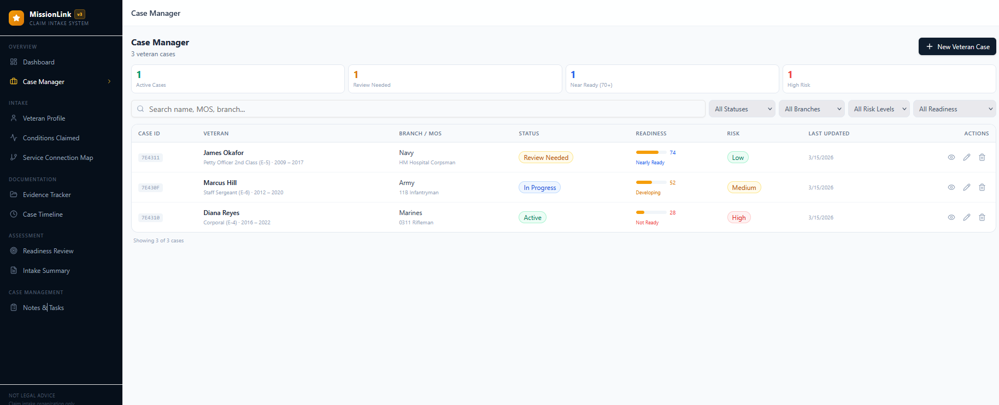
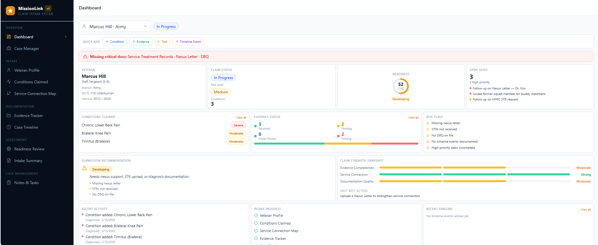
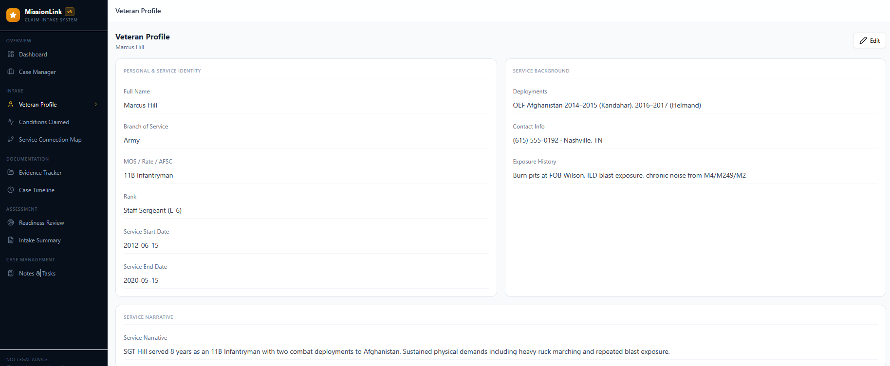
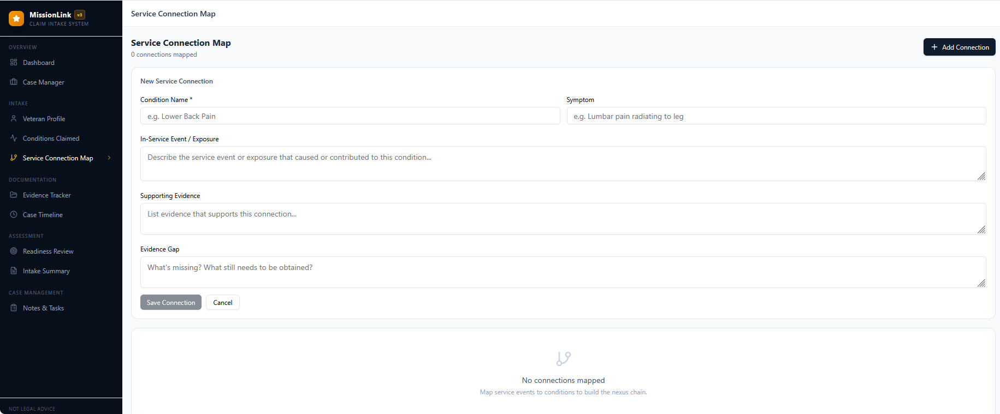

# Mission Link – Veteran Claim Intake System

Mission Link is a prototype case management and intake workflow platform designed to help organizations supporting veterans organize, track, and prepare VA disability claims.

The system focuses on structuring the intake process by capturing key service information, monitoring claim readiness, and organizing supporting documentation required for claim development.

---

## Purpose

The VA disability claims process can be complex due to documentation requirements, service connection evidence, and medical records.

Mission Link explores how structured workflows and operational systems could simplify that process by:

- Structuring veteran intake information
- Tracking claim readiness and risk levels
- Organizing supporting documentation
- Improving operational visibility across cases

---

## Key Features

- Veteran case management dashboard  
- Claim readiness scoring and risk indicators  
- Structured veteran intake profiles  
- Service connection mapping  
- Evidence tracking and documentation workflows  
- Operational case management

---

# Screenshots

## Case Manager

The Case Manager provides a centralized workspace for tracking veteran cases, monitoring claim readiness, and organizing intake progress.

---

## Operational Dashboard

The dashboard provides a high-level operational overview of case activity and readiness levels.

---

## Veteran Profile

The Veteran Profile interface captures structured service history and intake information for claim preparation.

---

## Service Connection Map

The Service Connection Map helps visualize connections between service events and claimed conditions.

## Technology

Mission Link was prototyped using Base44, a rapid development platform used to design workflow-driven applications and operational dashboards.

Built using https://mission-link-pro.base44.app to rapidly prototype workflow systems.
---

## Author

Mckevin Nazaire  
U.S. Army Veteran  
Cybersecurity & Operations Enthusiast
